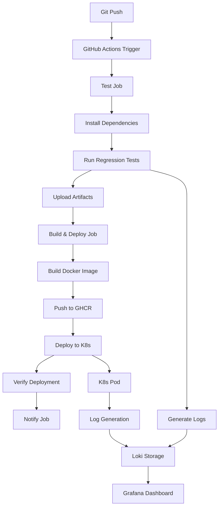

# GitHub Actions CI/CD Setup Guide

## Required GitHub Repository Secrets

To enable the complete CI/CD pipeline, you need to configure the following secrets in your GitHub repository:

### 1. Container Registry Access
- **GITHUB_TOKEN**: Automatically provided by GitHub Actions (no setup needed)

### 2. Kubernetes Cluster Access
- **KUBE_CONFIG**: Base64-encoded Kubernetes configuration file

## Setting Up GitHub Secrets

### Step 1: Navigate to Repository Settings
1. Go to your GitHub repository: `https://github.com/hariharansadagopan17/github-ci-bot`
2. Click on **Settings** tab
3. In the left sidebar, click **Secrets and variables** > **Actions**

### Step 2: Add Kubernetes Configuration

1. **Get your kubeconfig file**:
   ```bash
   # For local k3s cluster
   sudo cat /etc/rancher/k3s/k3s.yaml
   
   # Or for other Kubernetes clusters
   cat ~/.kube/config
   ```

2. **Encode to base64**:
   ```bash
   # Linux/WSL/Mac
   cat ~/.kube/config | base64 -w 0
   
   # Windows PowerShell
   [Convert]::ToBase64String([Text.Encoding]::UTF8.GetBytes((Get-Content ~/.kube/config -Raw)))
   ```

3. **Add the secret**:
   - Click **New repository secret**
   - Name: `KUBE_CONFIG`
   - Value: Paste the base64-encoded kubeconfig
   - Click **Add secret**

## CI/CD Pipeline Features

### 🔄 Automated Triggers
- **Push to main/develop**: Runs tests + deployment
- **Pull Requests**: Runs tests only
- **Manual dispatch**: Can be triggered manually

### 🧪 Testing Stage
- ✅ Node.js 18 setup with npm cache
- ✅ Chrome browser installation
- ✅ Dependencies installation
- ✅ Headless regression tests execution
- ✅ Test artifacts upload (screenshots, logs, reports)

### 🐳 Build & Deploy Stage
- ✅ Docker image build with buildx
- ✅ Push to GitHub Container Registry
- ✅ Kubernetes deployment update
- ✅ Rollout status verification
- ✅ Post-deployment health checks

### 📊 Monitoring & Logs
- ✅ Test results artifacts (30-day retention)
- ✅ Kubernetes pod logs in pipeline output
- ✅ Grafana dashboard for real-time log viewing
- ✅ Pipeline status notifications

## Testing the Pipeline

### 1. Enable GitHub Actions
Make sure GitHub Actions is enabled for your repository:
- Go to **Settings** > **Actions** > **General**
- Select "Allow all actions and reusable workflows"

### 2. Trigger First Run
```bash
# Make a simple change and push
echo "# Pipeline Test" >> README.md
git add README.md
git commit -m "test: trigger CI/CD pipeline"
git push origin main
```

### 3. Monitor Pipeline
1. Go to **Actions** tab in your GitHub repository
2. Click on the running workflow
3. Monitor each job: `test`, `build-and-deploy`, `notify`

### 4. View Deployment
```bash
# Check Kubernetes deployment
kubectl get pods -n regression-testing
kubectl logs -l app=regression-test -n regression-testing
```

## Pipeline Architecture



## Troubleshooting

### Common Issues

1. **KUBE_CONFIG Secret Issue**:
   ```
   Error: The connection to the server localhost:8080 was refused
   ```
   - Verify kubeconfig is properly base64 encoded
   - Ensure cluster is accessible from GitHub Actions runners

2. **Image Pull Issues**:
   ```
   Error: ImagePullBackOff
   ```
   - Verify GitHub Container Registry permissions
   - Check if image was pushed successfully

3. **Test Failures**:
   ```
   Tests failed due to browser issues
   ```
   - Check if Chrome is properly installed in the pipeline
   - Verify headless mode is working correctly

### Debug Commands

```bash
# Check pipeline status
gh run list --repo hariharansadagopan17/github-ci-bot

# View specific run logs
gh run view <run-id> --repo hariharansadagopan17/github-ci-bot

# Check Kubernetes status
kubectl get all -n regression-testing

# View pod logs
kubectl logs -l app=regression-test -n regression-testing --follow
```

## Next Steps

1. ✅ **Set up GitHub secrets** (KUBE_CONFIG)
2. ✅ **Push code to trigger pipeline**
3. ✅ **Monitor first deployment**
4. ✅ **View logs in Grafana dashboard**
5. ✅ **Configure alerting** (optional)
6. ✅ **Add more test scenarios** (optional)

Your regression testing framework is now fully automated with:
- 🚀 **Continuous Integration**: Tests on every push
- 🐳 **Containerized Deployment**: Docker + Kubernetes
- 📊 **Real-time Monitoring**: Grafana + Loki
- 🔄 **Complete Automation**: From code to deployment
