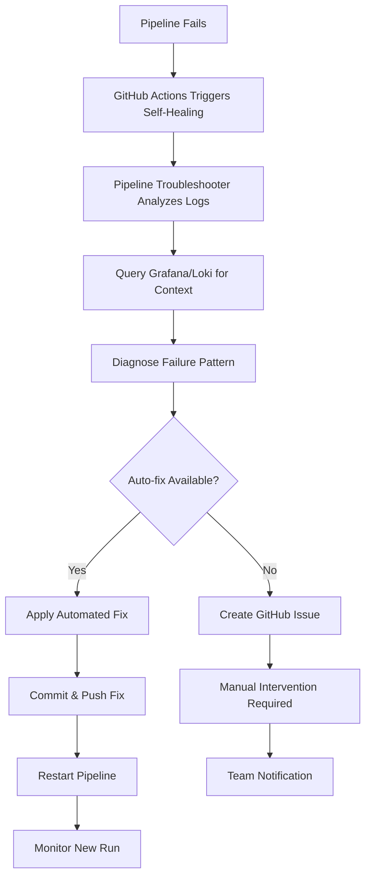

# 🔧 CI/CD Pipeline Troubleshooting & Auto-Recovery Guide

## Overview
This guide provides comprehensive troubleshooting mechanisms for your CI/CD pipeline failures with automated recovery capabilities using Grafana logs and GitHub Actions.

## 🚀 Quick Start Troubleshooting

### 1. Interactive Dashboard
```bash
cd RegressionTesting
npm run pipeline:dashboard
```

### 2. One-time Pipeline Check
```bash
npm run pipeline:troubleshoot
```

### 3. Continuous Monitoring
```bash
npm run pipeline:monitor
```

### 4. Auto-fix and Push
```bash
npm run pipeline:fix
```

## 🔍 Troubleshooting Workflow

### Automatic Recovery Process


## 📊 Monitoring & Alerting

### Real-time Pipeline Monitoring
The system provides multiple monitoring layers:

1. **GitHub Actions Self-Healing Workflow** (`.github/workflows/pipeline-self-healing.yml`)
   - Triggers on pipeline failures
   - Runs every 15 minutes
   - Creates issues for manual intervention

2. **Interactive Dashboard** (`pipeline-monitor-dashboard.js`)
   - Real-time pipeline status
   - Continuous failure monitoring
   - One-click troubleshooting

3. **Grafana Dashboard** (`grafana-pipeline-dashboard.json`)
   - Visual pipeline metrics
   - Log aggregation
   - Failure pattern analysis

### Setting Up Alerts

#### 1. Grafana Alerts
```bash
# Import the pipeline dashboard
curl -X POST \
  http://your-grafana-url/api/dashboards/db \
  -H 'Content-Type: application/json' \
  -d @grafana-pipeline-dashboard.json
```

#### 2. GitHub Issue Auto-creation
The self-healing workflow automatically creates GitHub issues for failures that can't be auto-fixed.

## 🛠️ Automated Fixes

### Supported Auto-fixes

| Failure Type | Fix Applied | Confidence |
|-------------|-------------|------------|
| npm install failed | Clear cache, use `npm ci` | 90% |
| Chrome not found | Add explicit Chrome setup | 95% |
| Selenium timeout | Increase timeout values | 80% |
| Kubernetes connection refused | Add connection verification | 90% |
| Docker build failed | Improve build caching | 85% |
| Image pull failed | Fix registry configuration | 85% |
| Test failures | Improve error handling | 70% |
| Loki connection failed | Add retry logic | 85% |

### Adding Custom Fixes

To add a new automated fix pattern:

1. Edit `pipeline-troubleshooter.js`:
```javascript
this.commonFixes.set('your-failure-pattern', this.fixYourPattern.bind(this));

async fixYourPattern(diagnosis) {
    // Your fix implementation
    const filePath = './path/to/file';
    // Apply fix
    await this.commitAndPush('fix: your fix description');
}
```

2. Test the fix:
```bash
npm run pipeline:troubleshoot
```

## 📈 Troubleshooting Commands

### Interactive Dashboard Commands
```bash
# Start interactive dashboard
npm run pipeline:dashboard

# Available options:
# 1. Check current pipeline status
# 2. Monitor for failures (continuous)
# 3. Run troubleshooter on recent failures
# 4. View Grafana logs
# 5. Restart failed pipeline
# 6. Generate troubleshooting report
# 7. Configure settings
# 8. Exit
```

### Direct Commands
```bash
# Check pipeline status
npm run pipeline:troubleshoot

# Start continuous monitoring
npm run pipeline:monitor

# Apply fixes and push
npm run pipeline:fix

# View Kubernetes logs
npm run k8s:logs

# Check deployment status
npm run k8s:status
```

## 🔧 Manual Troubleshooting

### Common Manual Fixes

#### 1. GitHub Secrets Issues
```bash
# Check if KUBE_CONFIG is set
gh secret list --repo your-username/your-repo

# Update KUBE_CONFIG if needed
kubectl config view --raw | base64 -w 0
gh secret set KUBE_CONFIG --body "base64-encoded-config"
```

#### 2. Kubernetes Connection Issues
```bash
# Test kubectl connection
kubectl cluster-info
kubectl get nodes

# Check if namespace exists
kubectl get namespace regression-testing

# Verify deployment
kubectl get all -n regression-testing
```

#### 3. Docker Registry Issues
```bash
# Test image pull
docker pull ghcr.io/your-username/your-repo/regression-tests:latest

# Check GitHub Container Registry permissions
gh auth token | docker login ghcr.io -u USERNAME --password-stdin
```

#### 4. Grafana/Loki Connection Issues
```bash
# Test Loki connection
curl http://localhost:3100/ready

# Check Grafana logs
docker logs grafana-container

# Test log ingestion
node push-logs-to-loki.js
```

### Debug Pipeline Locally

#### 1. Test Pipeline Components
```bash
# Test regression tests
npm test

# Test Docker build
npm run docker:build

# Test Kubernetes deployment
npm run k8s:deploy-tests
```

#### 2. Simulate Pipeline Environment
```bash
# Set environment variables
export HEADLESS=true
export CI=true
export NODE_ENV=production

# Run tests
npm test
```

## 📊 Monitoring Dashboard Access

### Grafana Dashboard
- **URL**: Access via ngrok tunnel or direct IP
- **Credentials**: admin/admin123
- **Dashboard**: Import `grafana-pipeline-dashboard.json`

### Query Examples
```logql
# Recent pipeline failures
{job="regression-tests"} |= "error" or |= "fail"

# Troubleshooter actions
{job="pipeline-troubleshooter"} 

# Auto-fixes applied
{job="pipeline-troubleshooter"} |= "fixApplied":true
```

## 🚨 Emergency Procedures

### Pipeline Completely Broken
1. **Stop automatic actions**:
   ```bash
   # Disable self-healing workflow temporarily
   gh workflow disable pipeline-self-healing.yml
   ```

2. **Manual investigation**:
   ```bash
   # Check recent runs
   gh run list --workflow="Regression Tests CI/CD Pipeline"
   
   # View specific run logs
   gh run view RUN_ID --log
   ```

3. **Fix and re-enable**:
   ```bash
   # After fixing issues
   gh workflow enable pipeline-self-healing.yml
   ```

### Grafana Unavailable
1. **Direct log access**:
   ```bash
   # View raw logs
   tail -f RegressionTesting/logs/regression-tests.log
   
   # View Kubernetes logs
   kubectl logs -l app=regression-test -n regression-testing --follow
   ```

2. **Restart monitoring stack**:
   ```bash
   # Restart containers
   docker restart grafana loki
   
   # Or redeploy
   npm run k8s:deploy-monitoring
   ```

## 📋 Troubleshooting Checklist

### Before Each Deployment
- [ ] GitHub secrets are configured (KUBE_CONFIG)
- [ ] Kubernetes cluster is accessible
- [ ] Grafana/Loki are running
- [ ] Docker registry access is working
- [ ] Test environment is clean

### After Pipeline Failure
- [ ] Check GitHub Actions logs
- [ ] Query Grafana for additional context
- [ ] Review troubleshooter recommendations
- [ ] Apply appropriate fixes
- [ ] Verify fix effectiveness
- [ ] Monitor subsequent runs

### Weekly Maintenance
- [ ] Review troubleshooter statistics
- [ ] Update fix patterns based on new failures
- [ ] Clean up old logs and artifacts
- [ ] Verify monitoring stack health
- [ ] Update documentation

## 🔮 Future Enhancements

### Planned Features
- **ML-based failure prediction**
- **Slack/Teams integration for notifications**
- **Advanced log correlation**
- **Performance regression detection**
- **Auto-scaling based on failure patterns**

### Contributing
To add new troubleshooting patterns:
1. Identify the failure pattern
2. Create a fix function in `pipeline-troubleshooter.js`
3. Test with the interactive dashboard
4. Submit a PR with documentation

---

**Your CI/CD pipeline now has intelligent self-healing capabilities!** 🎉

The system will automatically detect failures, analyze logs in Grafana, apply appropriate fixes, and restart pipelines - providing you with a robust, self-maintaining automation framework.
