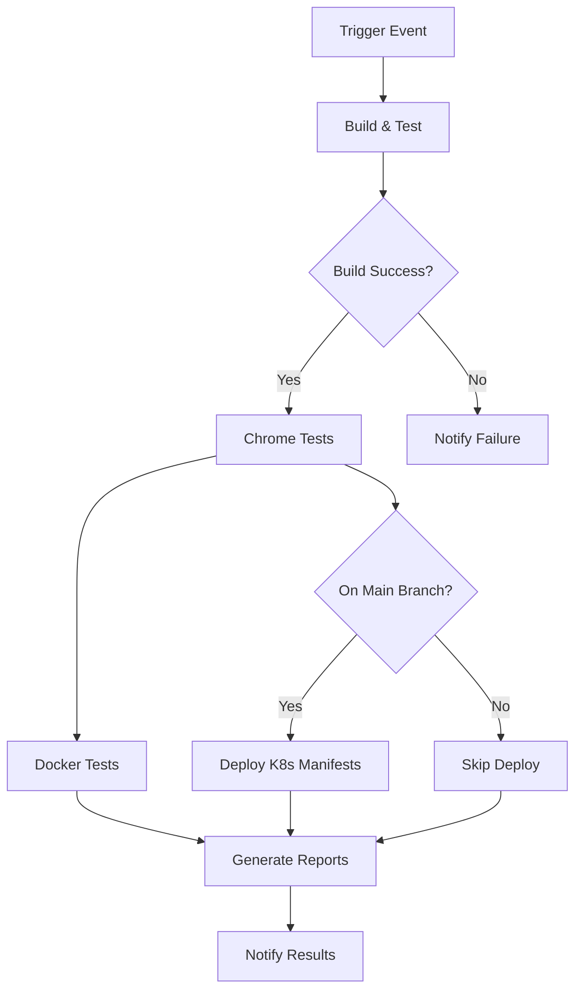

# GitHub Actions CI/CD Pipeline Documentation

## Overview

This document describes the comprehensive CI/CD pipeline for the regression testing framework using GitHub Actions. The pipeline automates building, testing, containerization, and deployment processes.

## Pipeline Structure

### Workflow Triggers

The pipeline is triggered by:
- **Push events**: On `main` and `develop` branches
- **Pull requests**: To `main` branch
- **Schedule**: Daily at 2 AM UTC
- **Manual dispatch**: With configurable parameters

### Pipeline Jobs

#### 1. Build and Test (`build-and-test`)
- **Purpose**: Build Docker image and push to GitHub Container Registry
- **Actions**:
  - Checkout code
  - Setup Node.js 18
  - Install dependencies
  - Run linting (with error tolerance)
  - Build and push Docker image to GitHub Container Registry
  - Add build metadata (build number, commit, branch)

#### 2. Chrome Headless Tests (`test-chrome-headless`)
- **Purpose**: Run regression tests in Chrome headless mode
- **Strategy**: Matrix execution for different test types (smoke, login)
- **Actions**:
  - Setup test environment
  - Install Chrome browser
  - Create mock application for testing
  - Run Cucumber tests with different tags
  - Upload test reports and screenshots

#### 3. Docker Container Tests (`test-docker`)
- **Purpose**: Validate tests running in Docker containers
- **Conditions**: Runs only on main branch
- **Actions**:
  - Pull built Docker image
  - Setup mock server
  - Run tests in containerized environment
  - Collect results

#### 4. Kubernetes Manifest Deployment (`deploy-k8s-manifests`)
- **Purpose**: Update and validate Kubernetes deployment manifests
- **Conditions**: Runs only on main branch after successful tests
- **Actions**:
  - Update image references in manifests
  - Add deployment metadata
  - Validate manifest syntax
  - Upload updated manifests

#### 5. Report Generation (`generate-reports`)
- **Purpose**: Consolidate all test results and artifacts
- **Conditions**: Always runs after test jobs
- **Actions**:
  - Download all test artifacts
  - Generate consolidated reports
  - Create test summary

#### 6. Notification (`notify`)
- **Purpose**: Provide pipeline status summary
- **Actions**:
  - Determine overall status
  - Create GitHub job summary
  - Display results dashboard

## Configuration

### Environment Variables

```yaml
env:
  DOCKER_IMAGE: regression-test-framework
  DOCKER_REGISTRY: ghcr.io
  KUBERNETES_NAMESPACE: regression-testing
  MONITORING_NAMESPACE: monitoring
```

### Required Secrets

The pipeline uses minimal secrets:
- **GITHUB_TOKEN**: Automatically provided by GitHub Actions
  - Used for: Container registry authentication, API access

### Optional Secrets (for extended functionality)

If you want to enable additional features, configure these secrets:

```yaml
# Slack notifications
SLACK_WEBHOOK_URL: your_slack_webhook_url

# AWS/EKS deployment (if using AWS)
AWS_ACCESS_KEY_ID: your_access_key
AWS_SECRET_ACCESS_KEY: your_secret_key
AWS_REGION: your_region
EKS_CLUSTER_NAME: your_cluster_name
```

## Workflow Inputs

### Manual Dispatch Parameters

When manually triggering the workflow:

- **test_environment**: Choose test environment (development/staging/production)
- **browser_mode**: Browser execution mode (headless/chrome)
- **test_tags**: Specific Cucumber tags to run (e.g., @smoke, @login)

## Artifacts

### Generated Artifacts

1. **Test Reports**
   - Cucumber HTML reports
   - JSON test results
   - Test execution logs
   - Retention: 30 days

2. **Screenshots**
   - Failure screenshots
   - Test execution captures
   - Retention: 7 days (failures), 30 days (all)

3. **Docker Images**
   - Built images in GitHub Container Registry
   - Tagged with branch, commit, and latest
   - Automatic cleanup policies apply

4. **Kubernetes Manifests**
   - Updated deployment files
   - Build metadata annotations
   - Retention: 30 days

5. **Consolidated Reports**
   - Combined test results
   - Execution summaries
   - Retention: 90 days

## Setup Instructions

### 1. Repository Setup

1. Ensure the regression testing framework is in the `RegressionTesting/` directory
2. Commit the pipeline file to `.github/workflows/regression-testing.yml`
3. Push to trigger the first run

### 2. GitHub Container Registry

The pipeline automatically uses GitHub Container Registry (ghcr.io) with the following configuration:
- **Registry**: `ghcr.io`
- **Authentication**: GitHub token (automatic)
- **Image naming**: `ghcr.io/{owner}/regression-test-framework`

### 3. Enable GitHub Packages

1. Go to repository Settings → Actions → General
2. Enable "Read and write permissions" for GITHUB_TOKEN
3. Allow actions to create and approve pull requests (if needed)

### 4. Configure Branch Protection (Optional)

For production environments:
1. Go to Settings → Branches
2. Add protection rule for `main` branch
3. Require status checks to pass
4. Require pull request reviews

## Pipeline Flow



## Test Execution Strategy

### Matrix Testing
- **Browser**: Chrome (headless mode)
- **Test Types**: Smoke tests, Login tests
- **Parallel execution**: Optimized for speed and resource usage

### Mock Application
The pipeline creates a simple mock web application for testing:
- Login page with form validation
- Dashboard with logout functionality
- Supports success and failure scenarios

### Test Tags
- `@smoke`: Quick validation tests
- `@login`: Authentication-related tests
- Custom tags can be specified via manual dispatch

## Monitoring and Observability

### GitHub Actions Dashboard
- Real-time execution status
- Job logs and timing
- Artifact downloads
- Workflow history

### Job Summary
Each run generates a comprehensive summary with:
- Status overview table
- Build information
- Next steps recommendations
- Direct links to artifacts

### Metrics Collection
- Test execution duration
- Success/failure rates
- Screenshot counts
- Build metadata

## Troubleshooting

### Common Issues

#### Build Failures
- **Cause**: Dependency installation issues
- **Solution**: Check package.json and npm version compatibility

#### Test Failures
- **Cause**: Browser compatibility, timing issues
- **Solution**: Review screenshots and logs, adjust timeouts

#### Docker Issues
- **Cause**: Image build or registry access problems
- **Solution**: Check Dockerfile and registry permissions

#### Manifest Validation Errors
- **Cause**: Kubernetes YAML syntax issues
- **Solution**: Validate manifests locally with kubectl

### Debug Steps

1. **Check Workflow Logs**
   - Navigate to Actions tab
   - Select failed workflow run
   - Review job logs for error details

2. **Download Artifacts**
   - Screenshots show visual state at failure
   - Reports contain detailed test results
   - Logs provide execution traces

3. **Local Reproduction**
   - Use same environment variables
   - Run tests with identical configuration
   - Compare local vs CI results

### Performance Optimization

#### Faster Builds
- Use npm ci instead of npm install
- Enable GitHub Actions cache
- Optimize Docker layer caching

#### Efficient Testing
- Parallel test execution
- Selective test running with tags
- Screenshot only on failures

#### Resource Management
- Appropriate job timeouts
- Artifact retention policies
- Container resource limits

## Security Considerations

### Secrets Management
- Never commit secrets to repository
- Use GitHub encrypted secrets
- Rotate tokens regularly

### Container Security
- Use official base images
- Regular dependency updates
- Minimal attack surface

### Access Control
- Branch protection rules
- Required reviews for sensitive changes
- Audit workflow modifications

## Extending the Pipeline

### Adding New Test Types
1. Update test matrix in `test-chrome-headless` job
2. Create corresponding Cucumber tags
3. Update test runner configuration

### Integration with External Services
1. Add service secrets to repository settings
2. Modify workflow to include service calls
3. Update notification logic

### Custom Deployment Targets
1. Add deployment job with appropriate conditions
2. Configure access credentials
3. Update manifest templates

## Best Practices

### Workflow Design
- Use meaningful job names
- Add appropriate conditions
- Handle failures gracefully
- Provide clear status messages

### Testing Strategy
- Maintain test independence
- Use stable test data
- Implement proper cleanup
- Monitor test stability

### Maintenance
- Regular dependency updates
- Monitor workflow execution times
- Review and update documentation
- Clean up unused artifacts

## Support

For issues with the pipeline:
1. Check GitHub Actions documentation
2. Review workflow logs and artifacts
3. Consult team knowledge base
4. Create support tickets with detailed information

## Version History

| Version | Date | Changes |
|---------|------|---------|
| 1.0.0 | 2025-08-10 | Initial pipeline implementation |
| | | - Docker build and push |
| | | - Chrome headless testing |
| | | - Kubernetes manifest management |
| | | - Automated reporting |
| | | - GitHub Container Registry integration |
